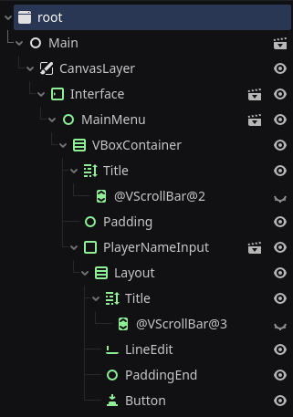

# Premessa

[Godot Engine] è un motore general purpose ed [open source] per la realizzazione di videogiochi multi-piattaforma.

Fa uso di un suo linguaggio di programmazione personalizzato, chiamato [GDScript], che prende ispirazione da [Python] sia nella sintassi, sia nel paradigma di programmazione.

Dato che lo sviluppo di videogiochi si svolge in modo molto più sperimentale e iterativo di quello dei software tradizionali, presenta alcune scelte di design particolari atte a rendere il codice fortemente componibile e veloce da scrivere.

Un'istanza di un software Godot consiste in una struttura ad albero, detta `SceneTree`, i cui nodi eterogenei hanno ciascuno delle proprie caratteristiche dette *proprietà*, un proprio comportamento detto *script*, delle implementazioni del pattern [observer]) dette *segnali*, e sono incapsulati in sottoalberi componibili detti *scene*.

Per più dettagli sui concetti chiave di Godot Engine, si suggerisce di fare riferimento alla [documentazione ufficiale] a riguardo, in particolare alla pagina [Overview of Godot's key concepts].

[Godot Engine]: https://godotengine.org/
[open source]: https://github.com/godotengine
[GDScript]: https://docs.godotengine.org/en/4.2/tutorials/scripting/gdscript/index.html
[Python]: https://www.python.org/
[observer]: https://en.wikipedia.org/wiki/Observer_pattern
[documentazione ufficiale]: https://docs.godotengine.org/en/4.2/index.html
[Overview of Godot's key concepts]: https://docs.godotengine.org/en/4.2/getting_started/introduction/key_concepts_overview.html