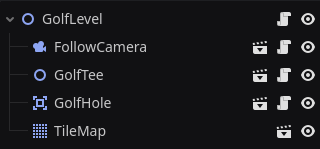

# Premessa

[Godot Engine] è un motore general purpose ed [open source] per la realizzazione di videogiochi multi-piattaforma.

Fa uso di un suo linguaggio di programmazione personalizzato, chiamato [GDScript], che prende ispirazione da [Python] sia nella sintassi, sia nel paradigma di programmazione.

Dato che lo sviluppo di videogiochi si svolge in modo molto più sperimentale e iterativo di quello dei software tradizionali, effettua alcune scelte di design particolari atte a rendere il codice fortemente componibile e veloce da scrivere.

## Nodi

Un ***nodo*** è un'astrazione molto simile a quella di un'**oggetto** nella programmazione ad oggetti.

### Tipo

Ciascun nodo ha un ***tipo*** tratto da una gerarchia che ne determina le *proprietà* che il nodo stesso avrà, come:

- `Node`, un nodo generico senza proprietà, estendibile da altri tipi
	- `Node2D`, sempre un nodo generico, ma avente proprietà che ne descrivono la posizione in un *piano bidimensionale*, detto ***mondo***
		- `Sprite2D`, che disegna sul mondo la texture specificata come proprietà alla posizione del nodo
		- `PhysicsBody2D`, che effettua periodicamente una simulazione fisica basandosi sulle proprietà del nodo e ne aggiorna la posizione relativamente 
		- `Camera2D`, che determina quale punto del piano bidimensionale deve essere visualizzato come centro della finestra
	- `Node3D`, un nodo generico come Node2D, ma che considera un *piano tridimensionale* come mondo
		- `MeshInstance3D`, che inserisce una mesh tridimensionale nel mondo
	- `Control`, un nodo generico usato per creare interfacce grafiche con proprietà che descrivono la *posizione nella finestra* che esso dovrà avere
		- `Label`, un nodo che scrive il testo specificato come proprietà alla posizione in cui si trova
		- `Button`, un nodo che disegna un bottone cliccabile alla posizione in cui si trova

I tipi corrispondono quindi bene o male al paradigma dell'**ereditarietà** della programmazione a oggetti.

### Figli

Ciascun nodo può avere dei ***figli***, le cui proprietà sono influenzate dalle proprie, ad esempio:

- un `Node2D` figlio di un'altro `Node2D` specificherà la propria posizione non relativa all'origine del mondo, ma *relativa alla posizione del genitore*
- cinque `Label` figli di un `VBoxContainer` saranno allineati automaticamente *uno sotto l'altro*, mostrando così cinque righe di testo

Generalmente, i figli sono utilizzati per estendere funzionalità ai nodi in modo componibile; corrispondono quindi al paradigma della **composizione** della programmazione a oggetti.

### Segnali

Oltre a proprietà e figli, ciascun nodo può avere dei ***segnali***, corrispondenti al pattern [observer] nella programmazione oggetti.

Il tipo di nodo determina quali segnali sono disponibili per esso.

Alcuni esempi di segnali:

- `Button` ha un segnale `pressed()`, che viene emesso quando il bottone viene premuto
- `Area2D` ha un segnale `area_entered(body: RigidBody2D)`, che viene emesso quando un corpo fisico entra nell'area ricoperta dal nodo

Altri nodi possono connettersi ai segnali per effettuare dei comportamenti in risposta ad essi.

### Script

Il comportamento di ciascun nodo può essere esteso collegandoci uno ***script***, un file di codice in uno dei linguaggi supportati che viene valutato all'avvio del gioco.

I linuaggi supportati variano in base ai moduli installati dell'editor; per questo progetto, si è scelto per semplicità di utilizzare ***GDScript***, i cui file hanno l'estensione `.gd`.

Ciascuno script determina un'*estensione* ad uno dei tipi di nodo; come risultato, uno script può essere collegato solamente ai nodi possedenti il tipo che esso estende.

Gli script possono aggiungere al nodo sia delle loro proprietà, sia dei loro segnali.

## Scene

Se un nodo è l'equivalente di un oggetto, una ***scena*** è l'equivalente di una *classe* nella programmazione ad oggetti.

Qualsiasi nodo può essere salvato assieme al suo script, a tutte le sue proprietà, tutti i suoi figli, e tutti i suoi segnali in un file `.tscn`, per poi essere *istanziato* in seguito, anche in più *copie*.

## Vedi anche

Per più dettagli sui concetti chiave di Godot Engine, si suggerisce di fare riferimento alla [documentazione ufficiale] a riguardo, in particolare alla pagina [Overview of Godot's key concepts].

[Godot Engine]: https://godotengine.org/
[open source]: https://github.com/godotengine
[GDScript]: https://docs.godotengine.org/en/4.2/tutorials/scripting/gdscript/index.html
[Python]: https://www.python.org/
[observer]: https://en.wikipedia.org/wiki/Observer_pattern
[documentazione ufficiale]: https://docs.godotengine.org/en/4.2/index.html
[Overview of Godot's key concepts]: https://docs.godotengine.org/en/4.2/getting_started/introduction/key_concepts_overview.html