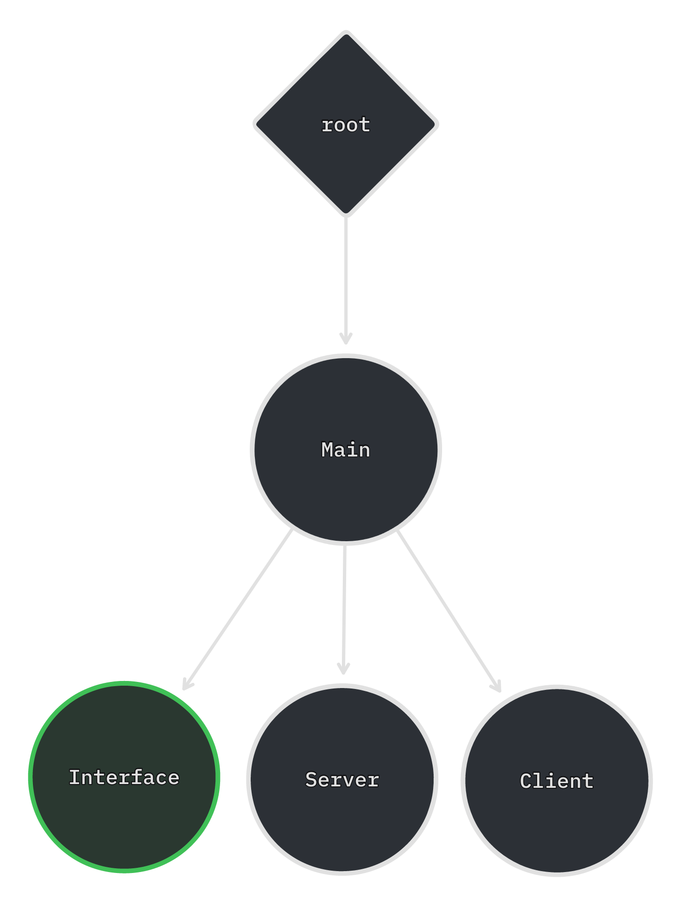

# Architettura di rete di Nanogolf

## [`Main`](../scenes/main.gd)

Il `Node` `Main`  è alla radice di ogni istanza del gioco, e si occupa di inizializzare e deinizializzare i nodi relativi al contesto attuale in cui si trova il gioco:

- all'avvio, esso inizializza l'interfaccia grafica `MainMenu`, e attende che essa emetta con uno dei due segnali `connecting_confirmed` (l'utente ha richiesto di connettersi a un dato server) o `hosting_confirmed` (l'utente ha richiesto di voler aprire un server);
- alla richiesta di connessione, sostituisce `MainMenu` con `LobbyMenu`, e crea un'istanza di `Game` chiamata "Client", configurandovi uno `SceneMultiplayer` separato e un relativo `ENetMultiplayerPeer` che si connetta al server richiesto;
- alla richiesta di apertura server, sostituisce allo stesso modo `MainMenu` con `LobbyMenu` e crea allo stesso modo "Client", ma la configura per connettersi sempre al server locale `127.0.0.1`, e inoltre crea una ulteriore istanza di `Game` chiamata "Server" con un proprio `SceneMultiplayer` ed `ENetMultiplayerPeer` che accetti connessioni in arrivo sulla porta UDP `12345`;
- all'inizio effettivo della partita, sostituisce `LobbyMenu` con `GameHUD`, che mostra al giocatore lo stato attuale della partita, e vi connette alcuni segnali di "Client";
- al termine della partita, o quando "Client" segnala che è stata persa o chiusa la connessione al server, riporta il giocatore al `MainMenu`.

> Per via di un bug in Godot Engine, attualmente la chiusura imprevista del server causa un crash senza log di errore in tutti i client connessi.

## [`Game`](../scenes/game.gd)

Il `Node` `Game` viene collocato sempre come figlio di `Main`, e rappresenta lo stato di gioco di un peer connesso ad una specifica stanza (anche detta "lobby" in inglese), che esso sia un server o un client.

Il server ha sempre autorità su di esso, e:

- gestisce connessioni e disconnessioni dei client, utilizzando la sua `PeerNodeDirectory` per mantenerne un indice composto da sottonodi di tipo `PeerNode` e aventi come nome l'identificatore del peer;
- quando un `PeerNode` connesso si identifica con il proprio nome, utilizza la sua `PlayerNodeDirectory` per controllare se è già connesso un giocatore con quel nome, creando un nuovo `PlayerNode` con quel nome se non esiste e dandone il controllo al relativo peer, oppure rimuovendo il controllo al precedente peer per darlo a quello nuovo nel caso esista già;
- quando un `PeerNode` identificato si disconnette, ridà il controllo del relativo `PlayerNode` al server;
- quando il giocatore host richiede attraverso l'interfaccia grafica di iniziare la partita, usa il `PhaseTracker` per cambiare ovunque la fase della partita da `LOBBY` a `PLAYING`, e richiede al `LevelManager` di istanziare il primo livello;
- quando il `LevelManager` segnala che la `LevelPlaylist` selezionata è esaurita, usa il `PhaseTracker` per aggiornare la fase della partita da `PLAYING` a `ENDED`.

## [`PeerNodeDirectory`](../scenes/peernode_directory.gd)

Il `Node` `PeerNodeDirectory`, essendo contenuto nella scena `game.tscn`, viene istanziato ricorsivamente in tutte le istanze di `Game`.

Come menzionato in precedenza, ha la responsabilità di mantenere aggiornato l'indice dei peer connessi, e a tale scopo rende disponibili al server le remote procedure call `rpc_create_peernode(peer_id)` e `rpc_destroy_peernode(peer_id)` in modo da permettere al server (e solo al server) di informare tutti i client dello stato attuale dei client connessi.

## [`PeerNode`](../scenes/peernode.gd)

Il `Node` `PeerNode` rappresenta un singolo peer connesso, di cui ne è la `multiplayer_authority`, e ha il suo identificatore impostato come proprietà `name`.

Ha un singolo metodo, che può essere chiamato come RPC solamente dal peer che controlla il nodo stesso: `rpc_identify`, che comunica al server il nome con cui il peer appena connesso si identifica agli altri.

Quando il server riceve un'identificazione di un peer, il relativo `PeerNode` emette il segnale `identified`, che viene propagato in alto fino a `Game`, il quale lo gestisce come descritto sopra.

## [`PlayerNodeDirectory`](../scenes/playernode_directory.gd)

Il `Node` `PlayerNodeDirectory` è molto simile a `PeerNodeDirectory`, ma invece che dei peer, tiene traccia dei giocatori effettivi nella partita, indicizzati per nome del giocatore rappresentato.

Dato che un giocatore, una volta entrato in una lobby, deve mantenere il proprio punteggio fino a quando la partita non è terminata, anche se non l'ha terminata perchè l'ha abbandonata a metà, non è incluso un modo per rimuovere un giocatore dall'indice, ma soltanto uno per aggiungerne uno nuovo.

Questo metodo è `rpc_possess_playernode(player_name, peer_id)`, chiamabile solo dal server, che controlla se un giocatore con il dato nome è già indicizzato, creando il relativo `PlayerNode` in caso negativo, e in entrambi i casi (ri)assegnando l'autorità su di esso al peer con l'identificatore specificato.

In aggiunta, è disponibile `rpc_push_reported_scores()`, chiamabile anch'essa solo dal server, che fa in modo che tutti i `PlayerNode` figli spostino in una lista il numero di colpi impiegati per entrare nella buca attuale (`reported_score`, descritto in seguito), resettando poi il contatore in preparazione alla buca successiva.

## [`PlayerNode`](../scenes/playernode.gd)

Il `Node` `PlayerNode` rappresenta un singolo giocatore nella partita, e la sua `multiplayer_authority` può variare in base ai peer attualmente connessi alla partita: essa prende il valore dell'ultimo peer che si è identificato con il relativo nome, se esso è ancora connesso, altrimenti l'autorità è assegnata al server fino a quando un nuovo peer non si riconnetterà con quel nome.

Esso include tante proprietà e metodi, in quanto è ciò che permette ai dati di uno specifico giocatore di persistere tra un livello e l'altro.

Tra questi, sono degni di nota:
- `sanitize_player_name`, una funzione statica che sostituisce con un underscore (`_`) tutti i caratteri non validi all'interno per il nome di un nodo (`/`, `*`, ` `) dal nome del giocatore;
- `player_name`, proprietà che assieme al nome del nodo stesso riflette il nome del giocatore (necessaria per via di un dettaglio implementativo di come Godot gestisce le stringhe nei nomi);
	- `rpc_set_name`, remote procedure call chiamabile solo dall'autorità che modifica il nome del giocatore in questione
		- il segnale `name_changed`, emesso quando il nome viene cambiato;
	- `rpc_query_name`, remote procedure call chiamabile da qualsiasi peer che richiede all'autorità di ripetere `rpc_set_name` con il nome attuale, in modo da comunicarlo anche ad un peer che si è connesso successivamente alla prima chiamata;
- `player_color`, proprietà che rappresenta il colore del giocatore;
	- `rpc_set_color`, authority RPC che modifica il colore;
		- il segnale `color_changed`, emesso quando il colore viene cambiato;
	- `rpc_query_color`, che fa ripetere `rpc_set_color` all'autorità con il colore attuale;
- `possess`, funzione di utilità che modifica la `multiplayer_authority` del nodo al valore dato;
	- il segnale `possessed`, emesso quando la `multiplayer_authority` è modificata attraverso `possess`;
- `hole_scores`, lista di `int` che rappresentano i colpi richiesti dal giocatore per entrare in buca nelle buche precedenti;
	- `rpc_set_scores`, remote procedure call chiamabile solo dall'autorità che modifica la lista dei punteggi;
	- `rpc_query_scores`, che fa ripetere `rpc_set_scores` all'autorità con i punteggi attuali;
	- il segnale `scores_changed`, emesso quando i punteggi vengono cambiati;
- `reported_score`, proprietà che assume il valore di `-1` mentre il giocatore sta affrontando la buca, e ottiene un valore corrispondente al numero di colpi impiegati per terminarla una volta finita;
	- `rpc_report_score`, remote procedure call chiamabile solo dall'autorità che imposta un reported score;
	- il segnale `score_reported`, emesso quando viene impostato un `reported_score` tramite `rpc_report_score`.

## [`PhaseTracker`](../scenes/phase_tracker.gd)

Il `Node` `PhaseTracker` si occupa di tenere traccia della fase in cui si trova la partita in ogni dato momento.

Le fasi possibili, rappresentate dall'enumerazione `Phase` e immagazzinate nella proprietà `phase`, sono:
- `LOBBY`, il momento pre-partita in cui viene visualizzato l'elenco dei giocatori connessi ed è data all'host la possibilità di iniziare;
- `PLAYING`, il momento in cui la partita sta venendo disputata;
- `ENDED`, il momento in cui la partita è terminata, e stanno venendo mostrati a schermo i risultati.

La sua autorità è sempre posseduta dal server, e come `PlayerNode`, include una coppia di RPC per modificare la fase attuale, `rpc_set_phase` e `rpc_query_phase`, più un segnale `phase_changed` emesso quando la fase viene effettivamente cambiata.

## [`LevelPlaylist`](../scenes/level_playlist.gd)

Il `Node` `LevelPlaylist` contiene una lista `levels`, che in riferimenti a scene rappresentanti i livelli precostruiti che il server invierà ai client.

L'indice del livello attuale viene salvato nella proprietà `idx`, mentre una funzione `advance` restituisce il prossimo livello dalla lista emettendo simultaneamente il segnale `advanced(level)`.

Sui client, `idx` rimane sempre fisso a `-1`, in quanto essi non caricano il livello da una lista predefinita, ma lo costruiscono dinamicamente in base ai dati che il server invia loro.

## [`LevelManager`](../scenes/level_manager.gd)

Il `Node` `LevelManager` è gestito dal server, e si occupa di inizializzare i livelli sia su client, sia su server.

Fa uso di tre RPC chiamabili solo dal server:
- `rpc_wipe_level`, che decostruisce il livello attuale, se presente, e ne inizializza uno nuovo, preso dalla `LevelPlaylist`;
- `rpc_destroy_level`, che distrugge il livello attuale e non fa nient'altro, usato per procedere in sicurezza alla schermata dei risultati;
- `rpc_level_completed`, che emette il segnale `level_completed` su tutti i client.

Sono inclusi numerosi segnali che corrispondono alle varie fasi del ciclo di vita di un livello, come `level_destroying`, `level_destroyed`, `level_determined`, `level_initialized`, `level_built` e `level_completed`.

Un segnale specifico è relativo al ciclo di vita dell'intera playlist: quando i livelli disponibili sono esauriti, viene emesso il segnale `playlist_complete`, che viene poi raccolto da `Game` per avanzare alla fase `ENDED`.

## [`GolfLevel`](../scenes/golf_level.gd)

Il **`Node2D`** `GolfLevel` è ancora una volta gestito dal server, e contiene gli elementi "effettivi" della buca che i giocatori andranno ad affrontare.

Si può comportare in due diversi modi in base al contesto in cui viene usato:
- gli può essere specificata nella proprietà `target` una scena contenente un altro `GolfLevel` da `LevelManager`; essa verrà istanziata senza essere aggiunta al mondo di gioco, poi da quella scena verranno lette varie proprietà dai nodi `FollowCamera`, `GolfTee`, `GolfHole` e `TileMap` presenti in essa e attraverso RPC saranno replicate su tutti i peer;
- gli può essere specificato `null` nella proprietà `target`, rimanendo così in attesa di ricevere RPC dal server per costruire il livello secondo istruzioni.

### Replicazione remota di `GolfLevel`

La replicazione remota di un livello segue i seguenti passi:

1. il server legge la `global_position`, `global_rotation` e `global_scale` della `TileMap` target, poi chiama `rpc_build_tilemap` usandoli come argomenti, istanziando nel mondo di gioco una griglia vuota nella stessa configurazione di quella target;
2. il server itera su tutti i tile della `TileMap` target, e per ciascuno chiama `rpc_build_tilemap_cell` passandogli le caratteristiche del tile da copiare, istanziando così nel mondo di gioco i "muretti" della buca;
3. il server guarda la posizione del `GolfTee` target, e usa `rpc_build_tee` per ricrearlo lì, connettendo inoltre il suo segnale `everyone_entered_hole` a una sua funzione interna che fa arrivare `level_completed` a `LevelManager` dopo qualche secondo;
4. il server itera su tutti i `PlayerNode` presenti nella `PlayerNodeDirectory` del `Game` attuale, e per ognuno di essi chiama `rpc_build_ball` con le relative caratteristiche, che includono la posizione, il numero attuale di colpi effettuati, e se la pallina è entrata in buca;
5. il server guarda la posizione e la dimensione della `GolfHole` target, e chiama `rpc_build_hole` passandoglieli come parametri,
6. il server guarda la posizione di `FollowCamera`, e controlla il parametro `camera_follows_payer` del target, per poi istanziare una nuova `FollowCamera` nel mondo di gioco e, se `camera_follows_player` è attivato, la configura per seguire la `GolfBall` controllata dal giocatore locale.

## [`GolfTee`](../scenes/golf_tee.gd)

Il `Node2D` `GolfTee` è sempre gestito dal server, e funziona sia da directory delle "palline" che i giocatori controllano nel corso del livello, sia come loro istanziatore.

Non contiene remote procedure call, perchè la `GolfLevel` ha la responsabilità di richiedere ai peer la creazione di una nuova entità del livello, ma contiene un metodo `spawn` di cui `rpc_build_ball` fa uso.

Connette i segnali `name_changed`, `color_changed`, `possessed` emessi dal `PlayerNode` alle `GolfBall` `spawn`ate per rimanere sincronizzata con lo stato della stanza: ad esempio, se il giocatore dovesse disconnettersi, la relativa `GolfBall` verrebbe nascosta dal mondo di gioco, ma comunque mantenuta, in modo che qualora il giocatore si riconnetterà, continuerà a disputare la buca dalla posizione in cui si è disconnesso.

Inoltre, ogni volta che una `GolfBall` da esso istanziata entra nella buca, `GolfTee` chiama `rpc_report_score` sul relativo `PlayerNode`, e poi controlla se tutte le palline dei giocatori connessi (e quindi la cui `multiplayer_authority` del relativo `PlayerNode` è diversa da quella del server) sono entrate in buca, emettendo esso stesso il segnale `everyone_entered_hole`, che `GolfLevel` usa per determinare quando avanzare di livello.

## [`GolfBall`](../scenes/golf_ball.gd)

Il `Node2D` `GolfBall` usa il segnale `possessed` di un `PlayerNode` per imitarne i cambi di `multiplayer_authority`; in condizioni di connessione normali, ogni client controlla una sua `GolfBall`.

Ad ogni `physics_process`, il client che ha autorità su ciascuna `GolfBall` effettua un quanto di simulazione fisica, spostando la pallina secondo il vettore velocità salvato nella variabile `velocity` e applicando un attrito dissipativo per farla lentamente fermare.

Successivamente, il client con autorità chiama `rpc_set_global_position`, una remote procedure call che sposta **su tutti i peer che non stanno eseguendo la simulazione fisica** la pallina alla posizione fornita come valore.

Questa remote procedure call è l'unica in tutto il gioco che fa uso di un **canale di comunicazione diverso**: usando `unreliable_ordered`, ci si può permettere di effettuare la chiamata anche 60 volte al secondo, senza che sia un problema se alcune chiamate vengono perse, in quanto si è interessati solamente al valore più recente di posizione, e non ai valori storici che ha avuto nel passato.

Infine, sempre il client con autorità controlla se l'`HoleController` della pallina è sovrapposto ad un'area di tipo `GolfHole`: in caso affermativo, viene chiamato `rpc_do_enter_hole`, in modo che la pallina entrata in buca possa riprodurre un suono ed essere nascosta su tutti i client.

## [`PuttController`](../scenes/putt_controller.gd)

Il `Node2D` `PuttController` infine segue i cambi di `multiplayer_authority` di `GolfBall`, e ha una singola funzione: quella di trasformare gli input del giocatore locale in un vettore che `GolfBall` possa usare per applicare un impulso alla pallina.

Ha una singola RPC, `rpc_play_putt_sound`, che viene attivata ogni volta che viene terminato l'input per dare un colpo alla pallina, e riproduce un suono su tutti i client connessi.
